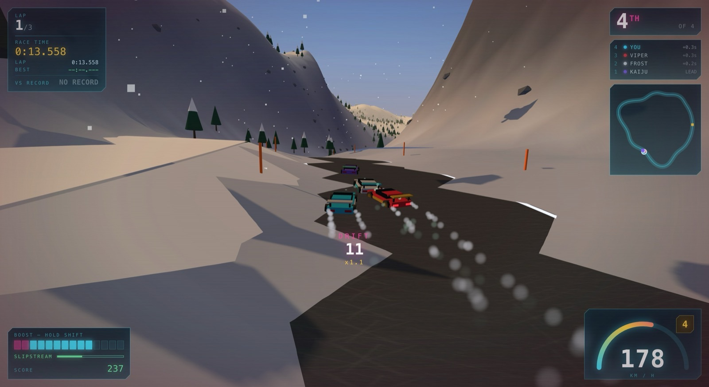
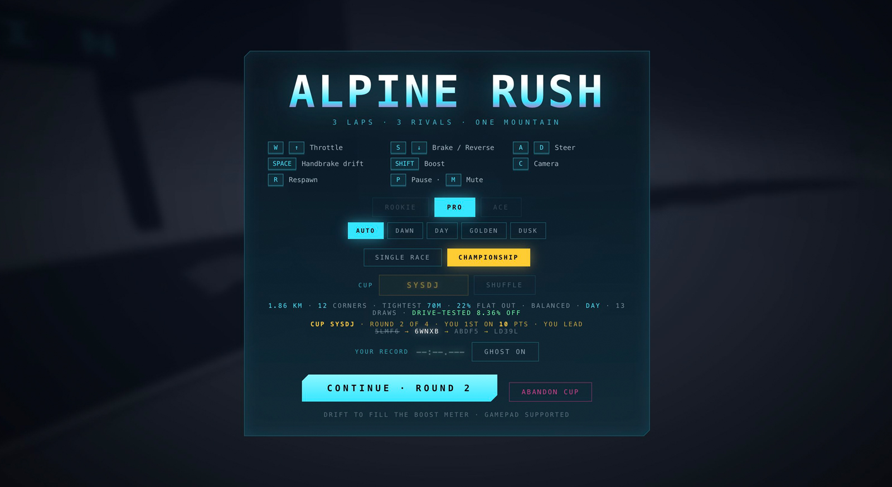
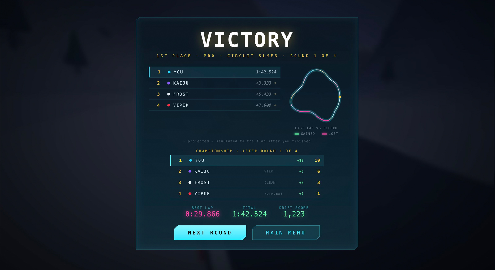

# 🏔️ Alpine Rush

A complete 3D arcade racer in a **single HTML file**. Three laps, three AI rivals, one mountain.
No build step, no bundler, no assets — every texture, sound and mesh is generated at runtime.

### ▶ [Play it now — arjunemirchandani.github.io/alpine-rush](https://arjunemirchandani.github.io/alpine-rush/)

No install, no build. Every circuit is shareable as a link:
[`?seed=JAKDA`](https://arjunemirchandani.github.io/alpine-rush/?seed=JAKDA) ·
[`?seed=MOUNTAIN`](https://arjunemirchandani.github.io/alpine-rush/?seed=MOUNTAIN) ·
[`?seed=6P8RA`](https://arjunemirchandani.github.io/alpine-rush/?seed=6P8RA) —
or a whole four-round championship: [`?cup=JAKDA`](https://arjunemirchandani.github.io/alpine-rush/?cup=JAKDA)



*The whole field covered by 0.3s, mid-drift with the slipstream engaged. Terrain, lighting, cars,
tyre smoke and every sound are generated at runtime — there is not a single asset file.*



*Every circuit is a seed, and so is every championship. Cup `SYSDJ` derives its four rounds from
those five characters; round two, `6WNXB`, is 1.86 km with 12 corners, drive-tested before you ever
see it. The seed, shuffle and difficulty lock while a cup is running.*

Or run it locally:

```bash
open alpine-rush.html
```

Or serve the folder and hit the origin — `index.html` is a short redirect that hands off to the
game, carrying `?seed=…` across so shared circuit links still work:

```bash
python3 -m http.server 8123 --bind 127.0.0.1
```

The game itself is still the one file; `index.html` exists so a served folder doesn't greet you
with a directory listing, and so GitHub Pages would serve it from the repo root as-is.

Needs a network connection on first load for the Three.js module (from unpkg). Everything else is self-contained.

---

## Hosting this on GitHub Pages (free)

Worth writing down, because a game like this needs no infrastructure at all — the whole deployment
is *push to `main`*.

**Cost is zero.** GitHub Pages is free for public repositories on a Free account; only *private*
repos need a paid plan for Pages. The soft limits are 1 GB of site size and 100 GB/month of
bandwidth. This site is ~140 KB, and Three.js is fetched from unpkg rather than from Pages, so the
bandwidth ceiling sits somewhere north of half a million plays a month.

**Enabling it** is one API call, or Settings → Pages → deploy from `main` / root:

```bash
echo '{"source":{"branch":"main","path":"/"}}' | gh api -X POST repos/OWNER/REPO/pages --input -
```

There is no build step and no workflow file. Pages serves the repository root as static files, so
committing an HTML file is the deploy.

**Two details that are easy to get wrong:**

*Serving the root.* Without an `index.html`, the origin shows a directory listing rather than your
game. This repo keeps the descriptive filename and adds a small `index.html` that hands off:

```js
location.replace('alpine-rush.html' + location.search + location.hash);
```

Carrying `location.search` across is the part people miss — drop it and every shared `?seed=…`
link silently loses its circuit and lands on the default, which looks like the app is broken rather
than the redirect. `replace()` rather than `assign()` keeps the hop out of the back history.

*Your email is in the commit metadata.* Git records the author and committer address on every
commit, and those are public once the repo is. Check with `git log --format='%ae' | sort -u`, and
if you'd rather not publish it, GitHub issues you a
`ID+username@users.noreply.github.com` address. Note that rewriting history and force-pushing is
**not** enough on its own: merged pull requests keep their original commits alive under
`refs/pull/N/head`, so the old addresses stay reachable from the PR pages.

---

## The title screen

The card is tabbed: **RACE** (single race or championship, the circuit or cup seed, featured cups,
your record and the ghost), **CONDITIONS** (difficulty, hour, weather), **CAR** and **CONTROLS**.
The title, a summary of what you're about to drive and START stay on screen whichever tab is open,
and the last tab is remembered.

### Choosing a car

**CAR** picks a body and a livery. There are six bodies — **GT**, **WEDGE**, **COUPE**, **MUSCLE**,
**SUPER** and **RALLY** — and eight liveries, and while the tab is open the card thins, the blur
lifts and the camera circles your actual car on the grid, so what you see is what you'll drive. The
choice is remembered.

### Classes

Each body drives differently. Six attributes — **speed**, **acceleration**, **grip**, **boost**
fill, **off-road** ability and how much of the **weather** it feels — are multipliers the physics and
the AI both read, so the rivals drive the car they are in too: VIPER's wedge is planted, FROST's
coupé is clean, KAIJU's muscle car is powerful and loose. The CAR tab shows them as five-pip bars,
three being the GT.

| | Character |
|---|---|
| **GT** | balanced, no surprises |
| **WEDGE** | aero grip, planted in the fast stuff, slow to accelerate |
| **COUPE** | clean, boost for days |
| **MUSCLE** | power, drifts at a glance |
| **SUPER** | fastest on the straight, short boost, hates the snow |
| **RALLY** | forgiving off the tarmac, feels only 60% of a blizzard, slow on the straights |

They were balanced on the headless harness — all four cars in one class, 120 s at PRO, eight
circuits from a 12-corner technical loop to 53 % flat out, in snow, clear and a blizzard. Every
class averages within **0.55 %** of the GT's lap time; no class is more than 3.1 % off the best on
any circuit; and four different classes take a win somewhere (WEDGE on the fast circuits, RALLY on
the tightest and in the blizzard, MUSCLE on the hairpin circuit, SUPER on the balanced one). COUPE
and GT never win and never lose. The first draft had MUSCLE and RALLY as outright losers; the
harness said so in seven seconds.

A record is still per circuit, but it remembers which car set it.

## Controls

| Input | Action |
|---|---|
| `W` / `↑` | Throttle |
| `S` / `↓` | Brake / reverse |
| `A` `D` / `←` `→` | Steer |
| `SPACE` | Handbrake — initiates a drift |
| `SHIFT` | Boost (spends the meter) |
| `C` | Cycle camera (chase / bonnet / cinematic) |
| `R` | Respawn on the racing line |
| `P` or `ESC` | Pause · `M` Mute |

**MAIN MENU** on the pause and results screens returns to the title without reloading, so you can
change circuit, difficulty or hour between races.

Gamepad is supported: left stick steers, RT/LT are throttle and brake, A drifts, B boosts.

Typing in the seed field is safe — driving keys are ignored while an input has focus.

**Boost engages only with real charge.** Below ~12% the meter is reserve — pressing `SHIFT` there
refuses and says so rather than spending your last sliver on a burst too short to feel. Those
segments are marked in magenta on the bar. Once engaged, every press delivers at least half a
second, so a tap always does something; hold it and a full meter is worth about three seconds.

**Drift is the boost economy.** Tap `SPACE` into a corner and steer through the slide — the meter
fills fast and a sustained slide builds a score multiplier up to ×6. Cruising above ~145 km/h
only trickles it. You start 4th of 4 on purpose.

---

## Circuits

The default circuit is `ALPINE` — the hand-tuned original. Any other seed string generates a
brand-new one: layout, elevation, mountain range, forest, kerbs and the AI's racing line all
regenerate together.

- Type a seed into the **CIRCUIT** field, or hit **SHUFFLE** for a random one.
- The URL tracks it, so `?seed=JAKDA` is a shareable link to an exact circuit.
- The same seed always produces the same track, on any machine.

The title card reports what you're about to drive:

```
2.29 KM · 11 CORNERS · TIGHTEST 48M · 42% FLAT OUT · TECHNICAL · 3 DRAWS
```

### Why every seed is drivable

Two different guarantees, applied at two different levels:

**Structural.** The centreline is a radial function `r(θ)`, so self-intersection is *impossible* —
no seed can ever produce a track that crosses itself. That isn't checked, it simply cannot happen.

**Measured.** Everything else — minimum corner radius, gradient, lap length, corner count — is not
guaranteed by the representation, so it is measured after generation and enforced:

```js
const LIMITS = { minRadius: 46, minR: 165, maxGrade: 0.27, len: [1650, 3000] };
```

A candidate that fails any limit is discarded and the next is drawn from the same seeded stream.
Because the stream is deterministic, the same seed always walks the same sequence and accepts the
same track. Over 66 test seeds: **zero fallbacks**, 4.7 draws on average, 15 at worst against a cap
of 60. Generated circuits ranged 1.81–2.31 km with 6–11 corners and tightest radii of 46–104 m.

**Driven.** Geometry proves a layout is *legal*, not that it is any *good*. Circuits kept turning up
that passed every geometric check and still had the field running wide for 10% of the lap. So a
candidate that clears the geometry filter is then actually driven — the full grid, headless, one
lap at PRO via `fastForward` — and rejected if the AI can't hold a clean line, gets stranded and
respawns, or fails to complete the lap.

The whole test is deterministic: fixed difficulty, fixed AI wander phases, and a seeded stream for
the collision jitter, so the same seed always reaches the same verdict. A test that sometimes
passed would hand out different circuits for the same seed.

Over 28 seeds it is a tail-cutting filter rather than a broad improvement, which is what it should
be — most circuits were already fine:

| | Geometry only | Drive-tested |
|---|---|---|
| Mean time off-track | 4.12% | 3.68% |
| Worst circuit | 10.56% | 8.57% |
| Circuits over 9% | **2 of 28** | **0** |

It costs ~1.07 drive tests per seed (about 60 ms), and importantly it does **not** homogenise the
pool — across 30 seeds only the 2 bad circuits changed, and the range of length, corner count,
tightest radius and flat-out percentage is identical before and after. It removes broken circuits
without flattening demanding ones.

The AI drives them unassisted — on the most technical generated seed (11 corners, 52 m tightest,
only 26% flat out) all four cars lapped in 38.6–40.4s.

The engineering write-up for each change is archived in
[`docs/PULL-REQUESTS.md`](docs/PULL-REQUESTS.md).

---

## Records and the ghost

Your best lap on each circuit is kept in `localStorage`, keyed by seed — so `JAKDA` means the same
track on any machine and a stored time is actually comparable. The title card shows your record for
the selected circuit, and beating it flashes **★ NEW RECORD**.

Alongside the time, the lap itself is recorded and replayed as a translucent **ghost** you race
against, with a live delta on the HUD: `−0.34` in green when you're up on your record, `+0.12` in
magenta when you're down.

The minimap turns that delta into a picture. As you lap, each stretch of the circuit is tinted by
how much time it gained or lost against the record — **green** where you were quicker than the
ghost, **magenta** where you weren't, brighter the bigger the difference. A stretch that merely
matched the record stays on the map's elevation shading, so colour always means something happened
there. The same trace, for your final lap, is shown large on the results card:



*Time lost to the record is drawn where it was lost. 0.08 s on one ~12 m segment is full colour;
smaller deltas blend only partway, so a clean lap reads quiet and a mistake reads loud. In a
championship the standings follow, with the points this round earned.*

**GHOST ON/OFF** hides the ghost if you'd rather drive without it; the choice is remembered across
sessions and is independent of the record, which stays either way. **CLEAR** wipes the record and
ghost for the selected circuit so you can chase it fresh — it takes two presses, the first arming
the button, since it can't be undone.

The trace is sampled at 20 Hz and each sample carries its arc length, which serves both jobs at
once — index by *time* to draw the ghost, or binary-search by *arc length* to answer "how far ahead
am I, right here". Positions are quantised to 0.1 m and headings to 0.001 rad, giving ~17 KB per
lap and 0.03 m of replay error; storage is capped at 25 circuits, oldest evicted first.

The arc-length search only works while `s` rises monotonically through the lap, so a trace that ran
past the finish line is truncated on write and rejected on read rather than silently misread.

Laps driven by autopilot are never recorded — records should mean you drove it.

---

## Championship mode

**CHAMPIONSHIP** on the title screen turns a race into a series: four rounds, points for every
finisher (**10 / 6 / 3 / 1**), a running table, and a champion at the end.

A cup is a seed, just like a circuit. `JAKDA` as a cup derives its four round circuits from that
seed (`CH768 → S7Z3L → W3ELF → RBLSB`), each a normal shareable circuit the generator drive-tests
like any other — so [`?cup=JAKDA`](https://arjunemirchandani.github.io/alpine-rush/?cup=JAKDA) is
the same series for anyone who opens it, and two people can race it on separate machines and
compare tables.

A few deliberate rules:

- **Results are decided at the flag**, from the same finishing order the results card shows —
  real times for cars that have finished, projected times for those still out. Nothing done at the
  card (or instead of it) can lose a round.
- **No retries.** RACE AGAIN becomes NEXT ROUND. The pause menu's RESTART still restarts the round
  you're in, because nothing is committed until you cross the line.
- **Difficulty locks at the start** of the cup; time of day follows each round's seed.
- **A cup survives a reload.** Leave mid-series and the title screen offers CONTINUE · ROUND *n*
  with the standings, or ABANDON CUP (two presses, like CLEAR).

### Cups worth racing

Any word is a cup, but some words deal better stories than others. These are on the title screen
under **Featured**, and each is a link:

| Cup | Rounds | |
|---|---|---|
| [`JAKDA`](https://arjunemirchandani.github.io/alpine-rush/?cup=JAKDA) | CLEAR · CLEAR · SNOW · SNOW | an easy introduction |
| [`ELEGANT`](https://arjunemirchandani.github.io/alpine-rush/?cup=ELEGANT) | four rounds at golden hour | the pretty one |
| [`GLACIER`](https://arjunemirchandani.github.io/alpine-rush/?cup=GLACIER) | BLIZZARD · BLIZZARD · BLIZZARD · CLEAR at dusk | earn the final |
| [`BLUEBIRD`](https://arjunemirchandani.github.io/alpine-rush/?cup=BLUEBIRD) | CLEAR · SNOW · BLIZZARD · WHITEOUT | the weather closes in, and the clock runs backwards — dusk, golden, dawn, day |
| [`BLACKOUT`](https://arjunemirchandani.github.io/alpine-rush/?cup=BLACKOUT) | four blizzards | good luck |

They were found by dealing every word in a dictionary through the round and weather streams and
keeping the ones with a shape. The cup panel shows every round's hour and weather before you start,
for any cup you type.

The three rivals keep the personalities they always had — VIPER is **ruthless**, FROST is
**clean**, KAIJU is **wild** — the cup just gives you four races to notice. Ties on points go to
wins, then to whoever finished ahead most recently. Your totals count cups completed and titles
won.

---

## How it works

### The track is an analytic curve, not a spline

The centreline is a radial function `r(θ)` sampled at 1500 points, rather than a hand-authored spline:

```js
r(θ) = 300 + w(θ) · (62·sin(3θ+0.6) + 28·sin(5θ+2.1) + 34·sin(2θ−0.9))
```

Because `r` is **single-valued in θ**, the curve provably cannot self-intersect. That one property
means lap counting can't double-fire, position ranking can't invert, off-track detection can't
confuse two nearby pieces of road, and the AI can't path onto the wrong lobe — all correct by
construction rather than by testing.

Everything else derives from that single function: terrain height, road and kerb ribbons, snow
banks, tree placement, the minimap and the AI's racing line. Nothing can drift out of sync with
anything else.

The `w(θ)` term fades the modulation out around θ=0, carving a constant-radius main straight
under the start gantry — somewhere to actually reach top speed.

The harmonics, amplitudes, phases and straight-width are drawn from a seeded PRNG, which is what
makes circuit generation nearly free: the representation was already a small bag of numbers.

### Rebuilding the world

Every track-derived mesh lives under a single `world` group. Re-seeding disposes it — geometries,
materials **and any texture the material owns**, since `material.dispose()` does not free textures
and that leaks one per rebuild — then rebuilds terrain, road, kerbs, banks, gantry and scenery.
Sky, lights, shared textures, cars and HUD are track-independent and survive untouched.
Verified at 12 consecutive rebuilds with zero growth in geometry or texture count.

### Drift physics

Velocity is decomposed into the car's local frame each step, forces are applied, then it is
recomposed against the **old** basis — so the body rotates while momentum keeps pointing the old
way. That's the drift.

Two deliberately *unphysical* details make it feel good rather than punishing:

- **Momentum recovery.** Scrubbed lateral velocity is partly fed back as forward drive, so a
  committed slide carries speed. Decaying it honestly to zero scrubs the car to a dead stop.
- **Self-catch.** The aligning torque ramps up past ~50° of slip, so the car rescues itself
  instead of spinning. You can throw it in harder than you'd otherwise dare.

### Difficulty

Three tiers, calibrated against a fixed-strength reference driver across 22 circuits:

| Tier | vs. reference driver | Feel |
|---|---|---|
| ROOKIE | +1.16 s/lap slower | a cushion, but you still have to drive |
| PRO | −0.14 s/lap | dead even — a real fight |
| ACE | −0.74 s/lap faster | you need drift, tow and boost to win |

Skill affects **execution**, not just ambition. An early version scaled only planned corner speed
(`latGrip`), which made higher tiers *slower* on tight circuits — they demanded grip that wasn't
there, ran wide, and lost more than the ambition gained. Measuring the lateral acceleration the car
actually pulls (`v · yawRate`: p50 14.8, p90 26.7, p95 28.9 m/s²) showed ACE was planning at the
p95 — achievable 5% of the time. Planned grip is now capped below p90, and skill instead buys
tighter line-holding plus a wide-running recovery term.

Measured over 10 circuits × 3 tiers, averaging **3 wander-phase realisations each**: 9/10 monotonic,
1.91 s/lap average ROOKIE→ACE spread. An earlier single-realisation run reported 22/22 and 2.84 s —
those figures were optimistic. Each rival draws a random wander phase per page load, which moves a
lap time by ~0.1–0.2 s, and on circuits where two tiers sit close together that is enough to flip
the ordering. Any tier comparison has to average over several realisations to mean anything.

**LEGEND** is a fourth tier above ACE. It drives the same car — same skill, same 5 % speed — and
adds technique instead: it brakes 30 % later into corners and spends boost on corner exits, where
boost accelerates, rather than on any clean straight. Measured on the harness it laps 2.3 % faster
than ACE on average, up to 9 % on technical circuits, and about 1 % slower on the fastest sweeper
circuits, with off-track essentially unchanged.

Two things it deliberately does *not* do, because the harness said no: drifting medium corners to
bank boost — the technique a good human uses — makes the AI slower, since it slides wide rather
than steering through the slide; and planning more corner speed buys nothing, because ACE already
sits at the car's grip ceiling.

Technique alone was worth 2 %; a player who drifts for profit is 15 % up on ACE. So LEGEND also
carries a **declared handicap** — its rivals' cars run **+10 %** in top speed, engine, grip and
steering — and the CONDITIONS tab says so in as many words. Finding the right handicap was its own
lesson: +10 % top speed alone bought under 1 % (the AI rarely reaches the ceiling), and grip alone
sent the rivals off the road, because in this drift model a corner's speed is set by *yaw rate*, not
grip. With steering authority included, +10 % laps 5 % faster than ACE with no more off-track,
+15 % about 7 %, +20 % about 8 %. The number is one constant (`LEGEND_HANDICAP`) if it needs to grow.

### Weather

Every seed also deals a condition, from its own stream and on top of the circuit — never part of
it, so `JAKDA` is still `JAKDA` whatever the sky is doing:

| | Sky | Falling | Handling |
|---|---|---|---|
| **CLEAR** (36%) | the hour as designed | nothing | dry |
| **SNOW** (34%) | fog a little closer | light flurries | grip × 0.94 |
| **BLIZZARD** (15%) | fog at ~90 m, flat grey light, snow-dusted road | heavy, wind-driven snow; slush off the tyres | grip × 0.80, side-wind gusts |
| **WHITEOUT** (15%) | the horizon gone: slope and sky one grey beyond ~140 m | a fine spindrift blowing sideways | grip × 0.97; the minimap earns its keep |

The AI feels it too: its cornering plan scales by the same grip factor, so the pack slows in a
blizzard instead of driving into the banks. Measured headlessly over six seeds at PRO, BLIZZARD costs
the bots 4–7% a lap with no more off-track excursions than a dry day. WHITEOUT barely touches them —
they see the curve — which makes it the one condition that is purely a test of *you*.

Gusts are deterministic (two slow sines in time, phased per grid slot), so projected finishes and
the drive test stay honest. Circuits are drive-tested **dry**: the weather is dealt on top of a track
already known to work.

The title screen can override the condition, like the hour. Racing in weather the seed didn't deal
flags **WEATHER OVERRIDE · NO RECORDS** and that race can't set a best lap — otherwise a BLIZZARD
seed's record could be set on a CLEAR day. Championship rounds always take their seed's weather.

### Time of day

Each circuit is lit by its own hour — dawn, midday, golden hour or dusk — drawn from the seed, so
`?seed=MOUNTAIN` always arrives at golden hour. `ALPINE` stays at midday. Override it from the
title card if you just want to see a particular light.

The lighting alone wasn't enough. Tinting the sun orange turns an alpine valley into a desert:
everything shifts warm together and the snow reads as sand. What actually sells low sun is
**shadow** — ridges throwing long shade, with those areas lit only by cool skylight.

The real-time shadow map can't do it: it covers a 70 m box around the player and only cars cast
into it. So sun occlusion is **baked into the terrain** at build time — each vertex marches a ray
toward the sun across the height grid, and anything blocked by a ridge is tinted toward a cool
shadow colour. The step grows with distance, so it costs ~30 ms during a rebuild and nothing per
frame. That single change is the difference between "orange filter" and golden hour.

Hours are drawn from a stream of their own. Drawn inline with the shape they were the last value of
each candidate, and because the generator discards whole candidates on retry, the surviving draw
came out at 43% dusk and 10% midday. Split out and warmed up, it sits within sampling noise of
uniform over 400 seeds.

### Slipstream

Tuck in behind another car — within ~30 m and ~3.4 m laterally — and you punch into their hole in
the air: extra drive under throttle, thinner aero drag, and a slightly higher terminal speed. It
only bites above ~65 km/h and only under power, so it rewards committing to a tow rather than
lifting. A meter on the HUD shows its strength; the screen streaks and the air noise rises with it.

The tuning is measured rather than guessed, and the first guess was wrong. An aggressive setting
(accel 8.5, +5.5% top speed, AI holding station at 0.22) raised overtaking but **spread the field
from 4.98 s to 6.40 s** — the tow let cars close up, then the AI sat in it instead of passing and
arrived off-line at the next corner, a slipstream train. A 10-seed parameter sweep found exactly one
setting that beats no-slipstream on field spread, gap to the leader *and* lead changes at the same
time:

| | Field spread | Gap 1st→2nd | Lead changes |
|---|---|---|---|
| off | 4.98 s | 2.20 s | 4.4 |
| **shipped** | **4.66 s** | **2.19 s** | **5.1** |
| too strong | 5.95 s | 2.14 s | 5.4 |

Rivals use it too — they ease off avoidance while tucked in on a straight, then slingshot past with
boost. Difficulty ordering is unaffected (10/10 monotonic with it on, 9/10 with it off).

Live-tunable at `__rush.TOW` if you want to feel the difference yourself.

### Results: projected finishes, not DNF

When you cross the line the rivals are still circulating, so their times aren't known yet. Printing
`DNF` for a car that is simply still racing is wrong, and extrapolating from average pace is only an
estimate. Instead the game **simulates the rest of the race headlessly** via `fastForward` and
reports what actually happens.

Every car's full physics state is snapshotted first and restored afterwards — verified
byte-identical across all four cars — so the scene behind the results card carries on undisturbed.
It early-exits the moment the last car is home, so it typically costs 0–8 simulated seconds
(single-digit milliseconds). Projected entries are dimmed and marked `◦` with a footnote; they're
computed by the real physics, but you didn't watch them happen, and the UI says so.

Results are shown as gaps to the winner rather than raw times.

### AI

All three rivals run the **identical physics function** as the player, just with synthetic inputs —
so they drift, smoke their tyres and burn boost exactly like you do. Each plans corner speed from
precomputed curvature ahead (`v = √(grip/κ)`), follows a band-passed curvature signal for an
out-in-out racing line, avoids other cars, and rubber-bands gently.

Measured over a full race: laps of 39–41s, off-track ~4%, drifting ~13–18% of the time, and a
finishing spread of **0.06 seconds** across two minutes of racing.

### Everything is generated

- **Audio** — Web Audio only. The engine is detuned sawtooth + square oscillators through a
  filter tracking simulated RPM across six gears; tyre screech, wind and off-track rumble are
  filtered noise; boost is a swept band-pass.
- **Results music** — when you cross the line the racing loops fade out and a four-bar loop fades
  in under the results card: Am–F–C–G at 92 BPM, soft triangle lead over a sine bass and a quiet
  sawtooth pad. Notes are scheduled on the audio clock rather than with timers, two seconds ahead,
  so it stays in time and does not gap if the tab is throttled.
- **Cars** — lofted, not modelled. A body is a run of rounded cross-sections along its length
  (sill width, shoulder width, floor, shoulder height, corner radius) stitched into one smooth
  shell; a second loft in glass is the cabin, with its top faces painted as the roof. Six
  silhouettes — GT, VIPER's low wedge, FROST's tall-cabin coupé, KAIJU's wide muscle car, a
  mid-engined supercar and a rally hatch — are each about 2,200 triangles, and every static part
  is merged into one draw call per material. The paint is a metallic base under a clearcoat that reflects an environment map baked
  from the sky dome whenever the hour or weather changes, so golden hour glows on the bodywork.
- **Terrain** — ridged fBm over a 280×280 grid, vertex-coloured for rock / snow / pine.
- **Textures** — asphalt, kerbs and the chequered line are drawn to `<canvas>` at load.
- **Effects** — pooled GPU particles for tyre smoke and snow spray; skid marks are a ring buffer
  of 2400 quads that fade via a birth-time attribute in the shader (zero per-frame CPU cost).

Roughly 96 draw calls and 645k triangles a frame on the title scene — the terrain is most of it;
all five cars together are under 12k.

---

## Debug handle

`window.__rush` is exposed for tinkering from devtools:

```js
__rush.Game.autopilot = true       // hand your car to the AI
__rush.player.boostMeter = 1       // fill the boost bar
__rush.Game.respawn()              // pop back onto the racing line
__rush.applySeed('ZEBRA')          // rebuild the circuit in place
__rush.Game.fastForward(105)       // simulate 105s headlessly (~120 ms)
__rush.Perf.snapshot()             // live fps, frame ms (mean / p95), draw calls, triangles
__rush.Perf.bench()                // 40 forced frames, ms each: compare before and after a change
```

Autopilot is off by default and takes effect on the next frame — no restart needed.

`fastForward` runs the simulation with no rendering, at roughly 850× real time, via the same
`stepSim()` the render loop uses — so balance measurements exercise the real physics rather than a
reimplementation. A 22-circuit × 3-difficulty sweep takes about seven seconds. It exists because
measuring balance through the rendered loop took ~40 minutes per sweep and was throttled by the
browser whenever the tab wasn't focused.

---

## A note on verification

The steering was inverted in the first playable build, and it survived *every* automated check —
because all of them were internally consistent. The AI derived its steering from world geometry
and silently self-corrected; the physics agreed with themselves; every number checked out. The
underlying cause was that `cross(up, forward)` gives the *left* normal in Three.js's right-handed
space, not the right.

A machine verifying its own coherence will never catch a convention that is wrong at the root.
It took one human at the keyboard about ten seconds. There's a comment at the definition in
`buildCentreline()` that ends *"Flip one, flip all."*

---

## License

[MIT](LICENSE) — do what you like with it, including commercially; just keep the copyright notice.

The only dependency is [Three.js](https://github.com/mrdoob/three.js), fetched from unpkg at
runtime and also MIT licensed. Nothing else is bundled: every texture, mesh, sound and circuit is
generated by the code in this repository.
